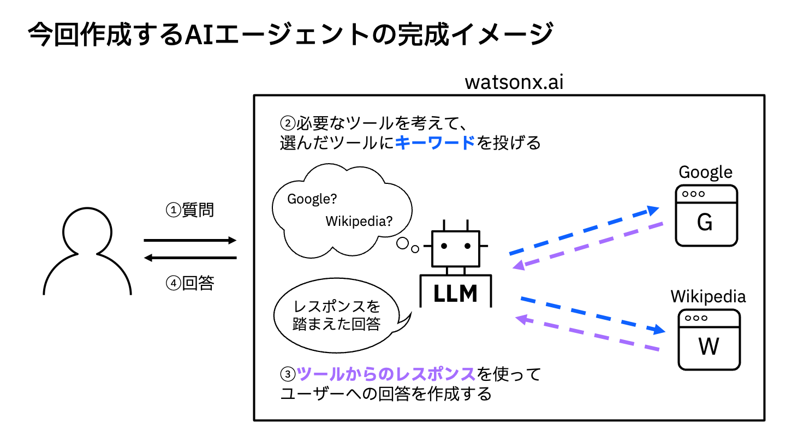

# 作って学ぶAIエージェント〜watsonx.aiでチャットボットを作ってみよう〜
watsonx.ai上で使用できるGoogle、Wikipedia検索のツールを用いて汎用的なAIエージェントを作ります。

## 0. 事前準備
[ワークショップ環境の事前準備](preparation/00_techzone_environments_preparation.md)

## 1. ワークショップ環境へのアクセス
[ワークショップ環境へのアクセス](preparation/01_techzone_use_environments.md)

## 2. watsonx.aiへのアクセス
[watsonx.aiへのアクセス](preparation/02_watsonx_ai_open_watson_studio.md)

## 3. ハンズオン実施
[ハンズオン実施](hands_on_guide.md)

## 4. その他の機能の紹介
[その他の機能の紹介](appendix.md)
