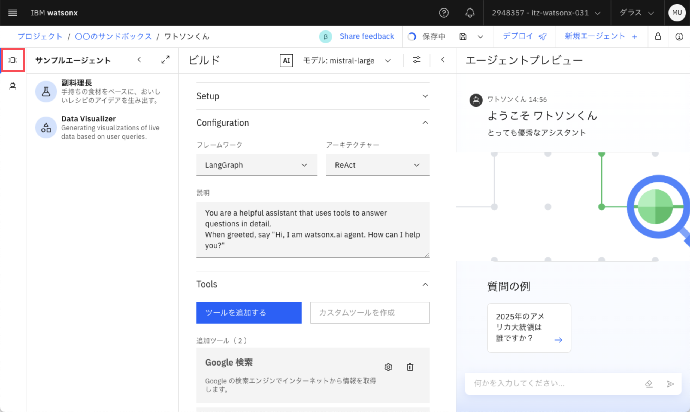
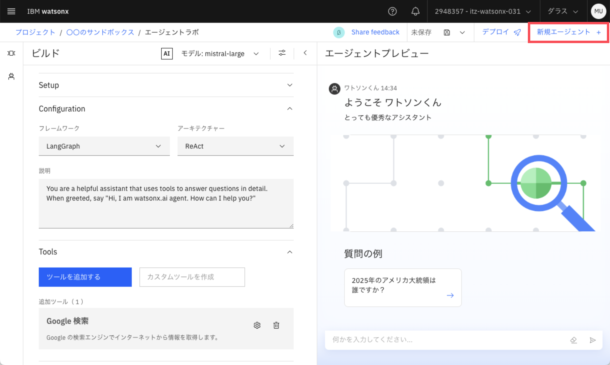
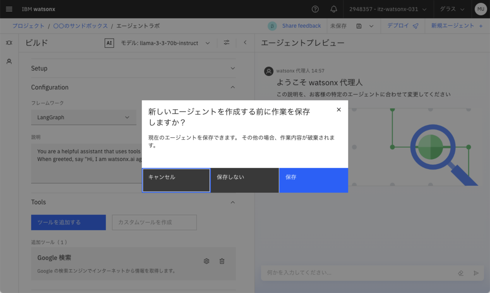
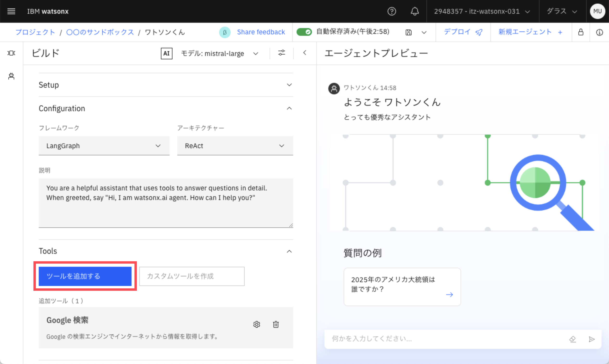
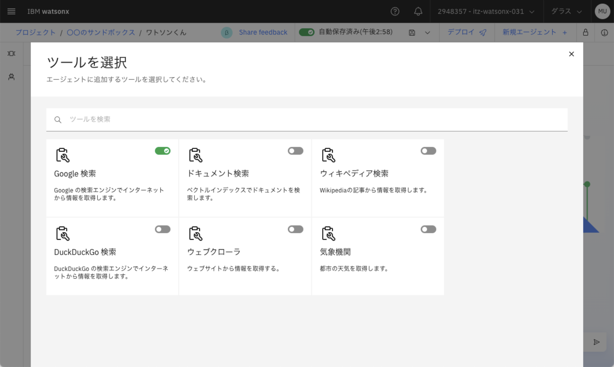
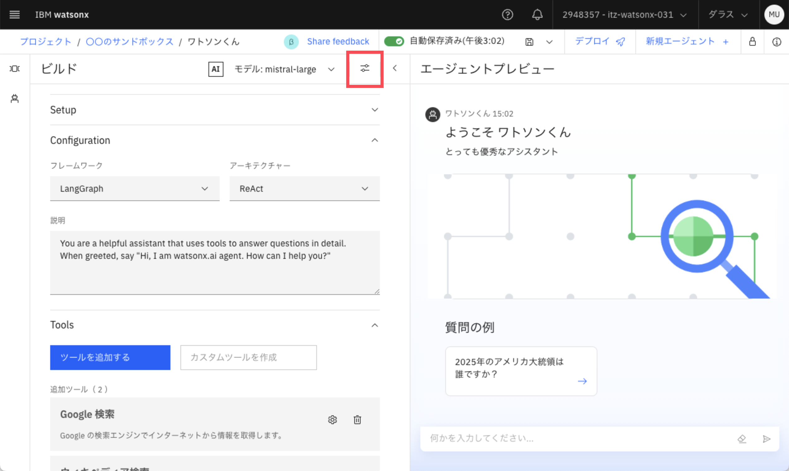
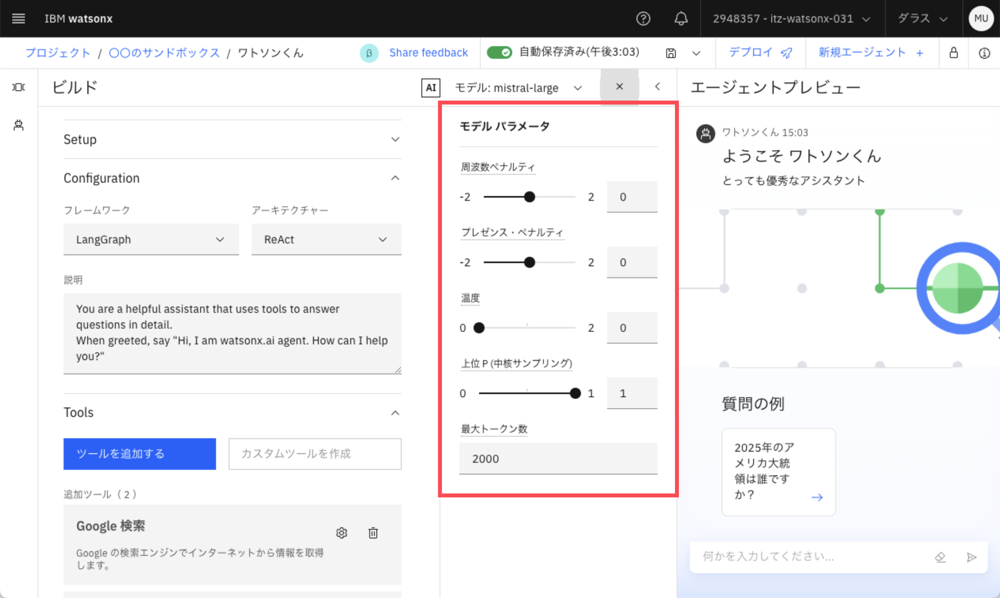

# 作って学ぶAIエージェント〜watsonx.aiでチャットボットを作ってみよう〜
## その他の機能の紹介
### サンプルエージェントを使う
1. `サンプルエージェント`ボタンをクリック
2. サンプルを選ぶ
    - 副料理長
        - 手持ちの食材をベースに、おいしいレシピのアイデアを生み出す。
    - Data Visualizer
        - ユーザーの入力に基づいて最新情報のグラフを生成。
        - **2025年2月26日現在、一時的にPythonを使用するツールや機能の提供が停止されているため、グラフの作成はできなくなっています**

### 新しいAIエージェントを作成する
1. `新規エージェント +`をクリック

2. 今作成しているAIエージェントを保存する場合は`保存`を、しない場合は`保存しない`を選択

3. `保存`を選択した場合、保存の手順をふむ
    1. 資産タイプの`エージェント`をクリック
    2. `保存`をクリック
    3. もう一度`新規エージェント +`をクリックし`保存しない`を選択
4. `保存しない`を選択した場合、新しいAIエージェントが開く

### 他のツールを使う
1. `ツールを追加する`をクリック

2. 使用したいツールを選択する
    - Google 検索
        - Web検索ツール
        - 検索結果をAIエージェントに渡す
    - ドキュメント検索
        - 調査中
    - ウィキペディア検索
        - Wikipediaの検索
        - 検索結果をAIエージェントに渡す
    - DuckDuckGo 検索
        - Web検索ツール
        - 検索結果をAIエージェントに渡す
        - 利用者のプライバシーの保護と利用履歴等を記録保存しないことを運営方針としているのが特徴
    - ウェブクローラ
        - Web検索ツール
        - 検索結果をAIエージェントに渡す
    - Python 通訳者
        - Pythonのモジュールが使用できる
        - グラフの描画などが可能
        - **2025年2月26日現在、一時的にPythonを使用するツールや機能の提供が停止されているため、こちらのツールは使用できません**
    - 気象機関
        - 気象情報を答える
        - 日本語の地名情報に対応していないためアルファベットで入力する必要がある
        - 例: Tokyo の天気を教えてください

### カスタムツールを作成する
- 簡単なPythonコードでオリジナルのツールを作成することが可能
- **2025年2月26日現在、一時的にPythonを使用するツールや機能の提供が停止されているため、こちらの機能は使用できません**
- [公式ドキュメント](https://dataplatform.cloud.ibm.com/docs/content/wsj/analyze-data/fm-agent-custom-tool.html?context=wx&locale=ja&audience=wdp)
    - [watsonx.aiにおけるPythonコードの取り扱いに関するルール](https://dataplatform.cloud.ibm.com/docs/content/wsj/analyze-data/fm-agent-custom-tool.html?context=wx&audience=wdp#py-func-specs)
    - [整数の積を計算するカスタムツール](https://dataplatform.cloud.ibm.com/docs/content/wsj/analyze-data/fm-agent-custom-tool.html?context=wx&audience=wdp#example-of-a-custom-tool-created-in-agent-lab)

### 作成したAIエージェントを公開する
- 詳細な手順は準備中です。詳しくは下記の公式ドキュメントをご確認ください。
    - [ツールを使用したAIサービスの展開](https://dataplatform.cloud.ibm.com/docs/content/wsj/analyze-data/ai-services-tools.html?context=wx&locale=ja&audience=wdp)
    - [AIサービス資産の展開](https://dataplatform.cloud.ibm.com/docs/content/wsj/analyze-data/ai-services-deploy.html?context=wx&locale=ja&audience=wdp)

### モデルのパラメータを設定する
1. `モデル パラメータ`をクリック

2. 各パラメータを変更する
    - 周波数ペナルティ (=反復ペナルティ)
        - 同じ単語やトークンが何度も繰り返されるのを防ぐ
        - 値が大きいほど強く制御される
        - 単語やトークンの出現頻度に基づいてペナルティを適用し、特定の表現やフレーズが繰り返し出現するのを抑制する
    - プレゼンス・ペナルティ
        - 同じ単語やトークンが何度も繰り返されるのを防ぐ
        - 値が大きいほど強く制御される
        - 単語が一度でも出現したかどうかに基づいてその単語の再出現の確率を直接減少させる
    - 温度
        - 生成されるテキストの確率分布を調整する
        - 温度が高いほど出力がランダムに、低いほど出力が確率の高いものに集中する
    - 上位 P (中核サンプリング)
        - 値が大きいほど出力されるテキストが多様かつ自然になる
    - 最大トークン数
        - 生成するトークンの最大数を設定する
- [公式ドキュメント](https://dataplatform.cloud.ibm.com/docs/content/wsj/analyze-data/fm-agent-lab.html?context=wx&locale=ja&audience=wdp#model)

