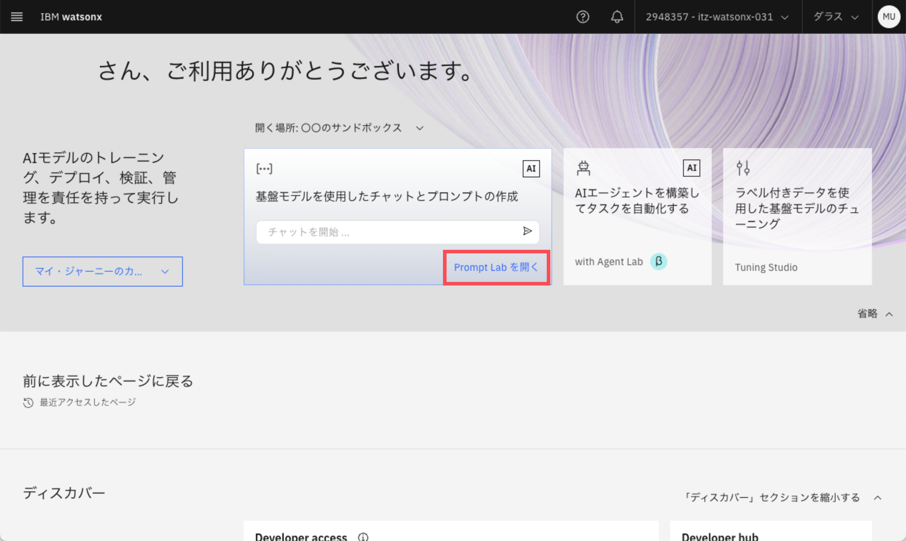

# 作って学ぶAIエージェント〜watsonx.aiでチャットボットを作ってみよう〜
watsonx.ai上で使用できるGoogle、Wikipedia検索や、Pythonコードの生成・実行などのツールを用いて汎用的なAIエージェントを作ります。


## 【AIエージェント作成の前に】通常のLLMとチャットしてみよう
### Prompt Labを開く
1. `Prompt Lab`のパネルをクリック

2. ポップアップはすべてチェックをつけて`ツアーのスキップ`を選択


### モデルの選択
1. モデルのパネルをクリック
2. `すべての基盤モデルを表示する`をクリック

3. `mistral-large`をクリック

4. `モデルの選択`をクリック


### 大統領を質問してみましょう
1. 入力欄に「2025年のアメリカ大統領は誰ですか？」と入力して送信

2. 想定した回答は返ってくるでしょうか？
3. watsonx.aiのホーム画面に戻る


## 汎用的なAIエージェントを作ろう
### Agent Lab (AIエージェントのビルドツール) を開く
1. `AIエージェントを構築してタスクを自動化する with Agent Lab`のパネルをクリック
2. ポップアップは全て×ボタンで消す


### モデルの選択
1. モデルのパネルをクリック
2. `すべての基盤モデルを表示する`をクリック

3. `mistral-large`をクリック

4. `モデルの選択`をクリック


### Setup
1. Setupを開く
2. `名前`を決める
    - 例) ワトソンくん
3. `説明`を書く
    - 例) とっても優秀なアシスタント
4. `アイコン`をカスタム
5. `プレースホルダー画像`をカスタム
6. `クイックスタートに関する質問`を入力 (ワンクリックで質問できるパネルが追加できる機能)
    ```
    2025年のアメリカ大統領は誰ですか？
    ```


### Configuration
- **今回は変更しない**
    - フレームワーク
        - AIエージェントの実装を支援するための具体的なツールやライブラリ
        - LangGraph: LangChainを基盤とした、エージェントやワークフローをグラフ構造で定義・制御できるフレームワーク
    - アーキテクチャー
        - AIエージェントの内部構造や動作原理を定義する設計原則やモデル
        - ReAct: AIエージェントが複雑なタスクを解決するために、推論（Reasoning）と行動（Acting）を組み合わせて効率的に行動するためのフレームワーク
    - 説明
        - AIエージェントへの指示(プロンプト)


### Tools
1. `ツールを追加する`をクリック

2. 下記のツールを選択
    - Google 検索
    - Wikipedia検索
    - Python 通訳者
    
    <!-- 上記画像Pythonが復活し次第差し替え -->
    - 詳細の定義は初期値のままでOK
    
3. AIエージェント完成です🎉
4. (補足) 詳細の定義の解説
    - `結果の最大件数`: ツールがLLM(生成AI)に渡す情報の数の最大値を設定
5. (補足) カスタムツールの作成
    - オリジナルのツールを作成することも可能
    - 詳しくは[appendix.mdの「カスタムツールを作成する」](appendix.md#カスタムツールを作成する)を参照

### 早速質問してみましょう
1. 先ほど設定した質問パネル「2025年のアメリカ大統領は誰ですか？」をクリック

2. `どうしてこんな答えが返ってきたのだろう？`をクリック

3. アコーディオンメニューを開く
4. 出力のプロセスを確認
    - 道具だ: このプロセスで使用したツール
    - 入力: LLM(生成AI)がツールに渡した情報
    - 出力: ツールがLLM(生成AI)に渡した情報


### 作成したAIエージェントを保存する
1. 保存ボタンをクリック
2. `名前をつけて保存`をクリック

3. 資産タイプの`エージェント`をクリック
4. `保存`をクリック

5. `保存されたエージェント`を開いて保存したエージェントが登録されていることを確認

6. (補足) 保存後LLMモデルが自動的に変更されてしまう場合があるため、使用したいLLMに設定されているか要確認

### 他の質問をしてみる
-  IBMとは？
<!-- -  GDPトップ5を棒グラフで教えてください -->
<!-- 上記Pythonが復活し次第コメントアウト解除 -->

#### 出力結果の例
###### IBMとは？


<!-- ###### GDPトップ5を棒グラフで教えてください

 -->
<!-- 上記2画像Pythonが復活し次第差し替え -->

