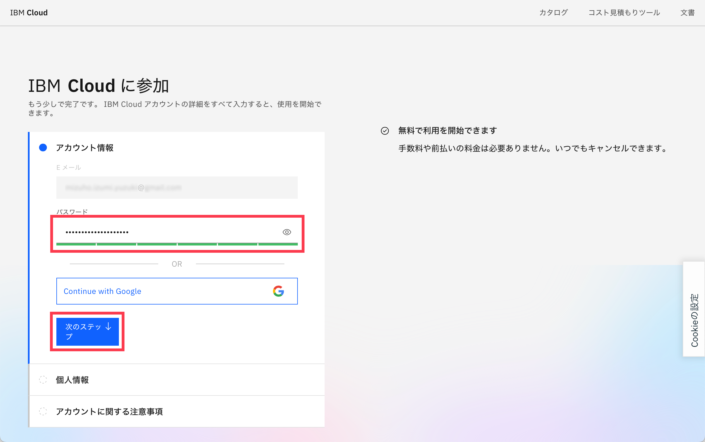
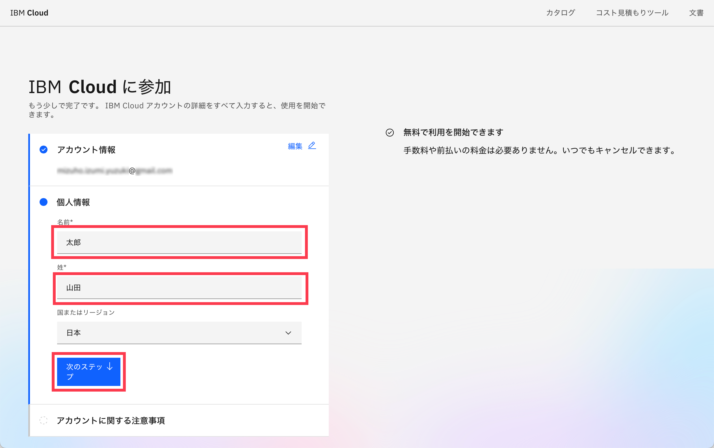
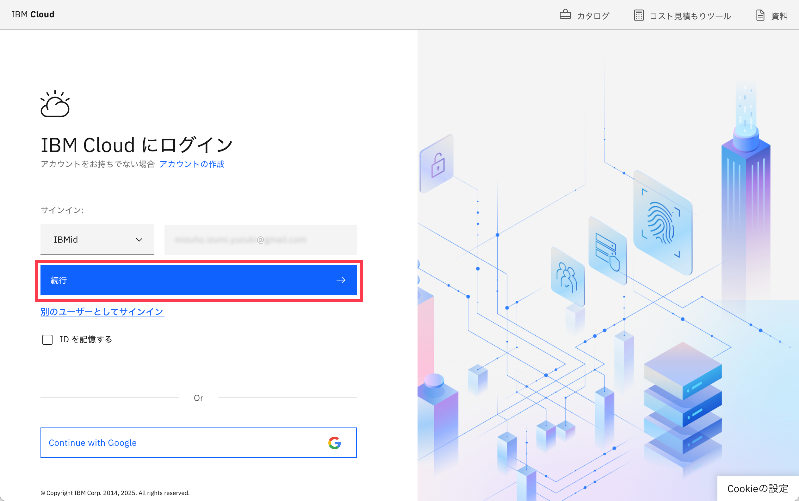
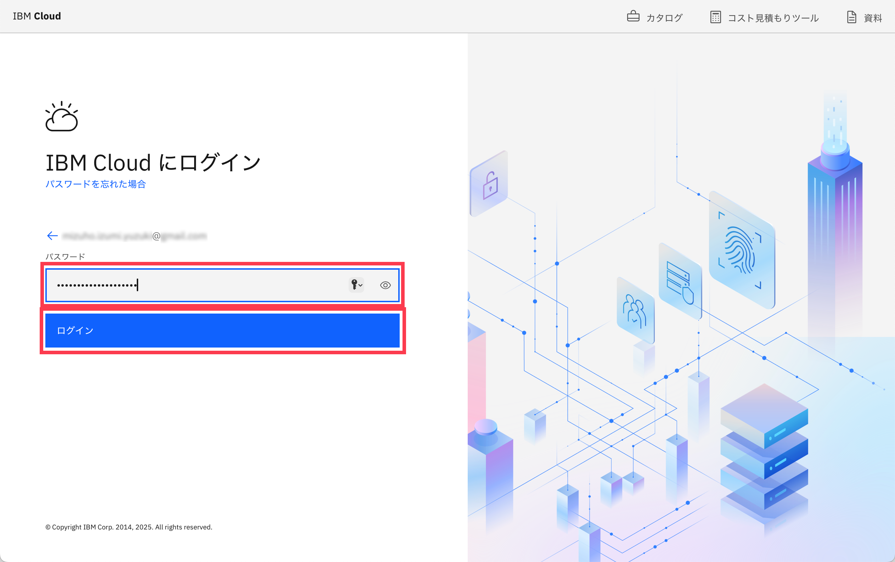
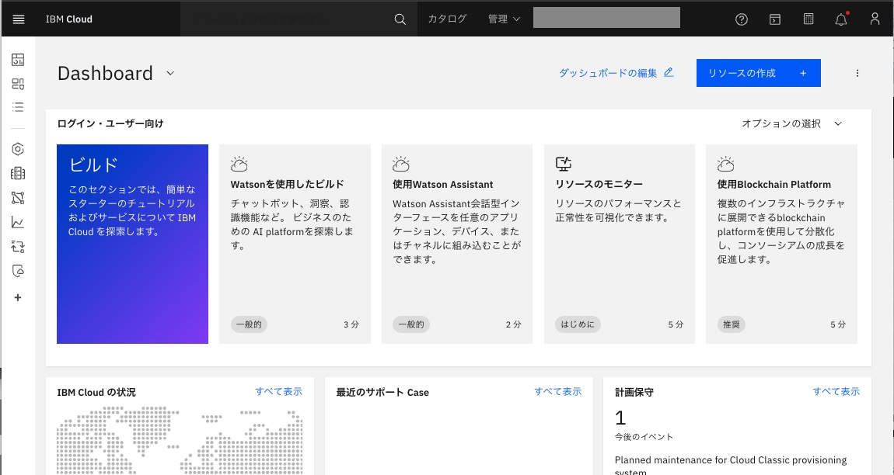

# ワークショップ環境へのアクセス
前提：
[ワークショップ環境の事前準備](00_techzone_environments_preparation.md)が実施していることが前提です。
実施していない場合は、まず[ワークショップ環境の事前準備](00_techzone_environments_preparation.md)を実施してください。

## 1. IBM Cloudから届いたメールの「Join now」をクリックしてIBM Cloudへアクセス
参加登録の際に入力いただいたメールアドレスに「Account: Action required: You are invited to join an account in IBM Cloud」という件名のメールが`no-reply@cloud.ibm.com`より送付されます。 
`Join now`をクリックしてIBM Cloudにアクセスしてください。 

## 2. (IBM Cloudのアカウントをお持ちでない場合)画面の指示に従ってアカウントを作成
1. パスワードを作成

2. 氏名を入力して`次のステップ`をクリック

3. チェックボックスにチェックを入れて`アカウントに参加`をクリック

## 3. IBM Cloudのアカウントでログイン
1. メールアドレスを確認後、`続行`をクリック

2. パスワードを入力して`ログイン`をクリック

ログインが成功するとIBM Cloudのダッシュボードが表示されます 
 

## 4. watsonx.aiへのアクセス
続けて、watsonx.aiへのアクセスをお願いします。 
手順は[watsonx.aiへのアクセス](preparation/02_watsonx_ai_open_watson_studio.md)を参照してください。

---
[作って学ぶAIエージェント〜watsonx.aiでチャットボットを作ってみよう〜 - トップページに戻る](../README.md)
