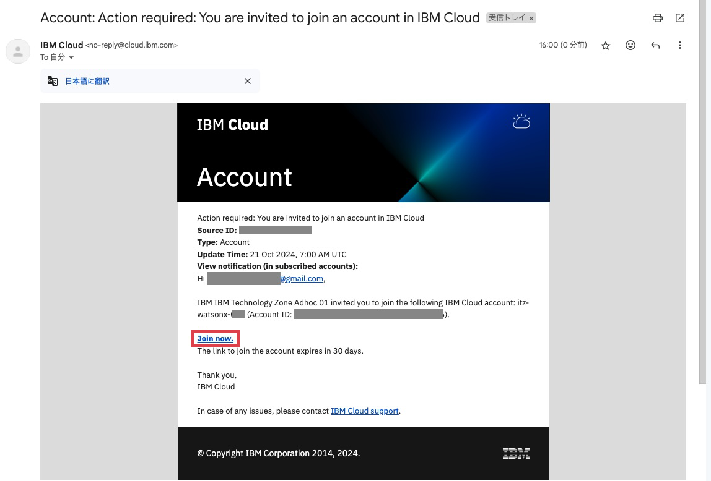
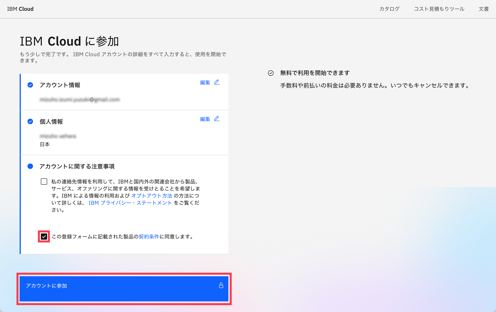

# ワークショップ環境へのアクセス
前提：
[ワークショップ環境の事前準備](00_techzone_environments_preparation.md)が実施していることが前提です。
実施していない場合は、まず[ワークショップ環境の事前準備](00_techzone_environments_preparation.md)を実施してください。

## 1. TechZone初期登録
こちらの初期登録は一度実施すれば次回ログインからは不要です。

### 1-1. 「TechZoneランディングページ」にアクセス
事前送付資料の4ページに記載されている「ワークショップ環境へのアクセスで使用するURL」にWebブラウザーでアクセスします。 

### 1-2. IBM idでのログイン
IBM idでのログインが必要ですので、準備したIBM idでログインしてください。 
 

### 1-3.cookieの許可
cookieの許可の画面が下部に表示されますので、「Accept all」か「Required only」のどちらかをクリックしてください。 

### 1-4.IBM Technology Zone Terms and conditionsのAccept
表示された「IBM Technology Zone Terms and conditions」を読んで、問題なければ、 
`I have read and accept the terms and conditions.`にチェックを入れ、「Submit」をクリックしてください。 

### 1-5:「Welcome to IBM Technology Zone! Tell us about yourself.」をSkip
「Welcome to IBM Technology Zone! Tell us about yourself.」というウィンドウが表示されたら、「Skip for now」をクリックしてください。 

### 1-6: IBM Technology Zoneのトップ画面が表示されます

## 2. 「TechZoneランディングページ」からIBM Cloud 環境にアクセス
### 2-1. 「TechZoneランディングページ」にアクセス
事前送付資料の4ページに記載されている「ワークショップ環境へのアクセスで使用するURL」にWebブラウザーでアクセスします。 
尚、前回のログインから時間が経っていると IBM idでのログイン画面が出ることがあります。　その場合は再度ログインお願いします。 

### 2-2. パスワードを入力し、「Submit password/access code」をクリック
事前送付資料の4ページに記載されている「ワークショップ環境へのアクセスで使用するPassword」を使用します。
「Enter the workshop password/access code.」
に上記のPasswordを入力し、 
「Submit password/access code」をクリックします。 
ログイン後、メールが届くまでしばらくお待ちください。 

### 2-3. IBM Cloudから届いたメールの「Join now」をクリックしてIBM Cloudへアクセス
使用したIBM idのメールアドレスに「Account: Action required: You are invited to join an account in IBM Cloud」という件名のメールが`no-reply@cloud.ibm.com`より送付されます。 
`Join now`をクリックしてIBM Cloudにアクセスしてください。 

### 2-4. (IBM Cloudのアカウントをお持ちでない場合)画面の指示に従ってアカウントを作成
1. パスワードを作成

2. 氏名を入力して`次のステップ`をクリック

3. チェックボックスにチェックを入れて`アカウントに参加`をクリック

### 2-5. IBM Cloudのアカウントでログイン
1. メールアドレスを確認後、`続行`をクリック

2. パスワードを入力して`ログイン`をクリック

ログインが成功するとIBM Cloudのダッシュボードが表示されます 
 

---
[作って学ぶAIエージェント〜watsonx.aiでチャットボットを作ってみよう〜 - トップページに戻る](../README.md)
