# watsonx.ai Studioの立ち上げ　

前提：
[ワークショップ環境へのアクセス](01_techzone_use_environments.md)が完了し、IBM CloudのダッシュボードがWebブラウザーに表示されていることが前提です。
 

## 1. watsonx.ai Studioへのアクセス
### 1-1. リソースリストの表示
左上のナビゲーション・メニューをクリック後、「リソース・リスト」をクリックし、IBM Cloudのリソース・リストを開きます。 
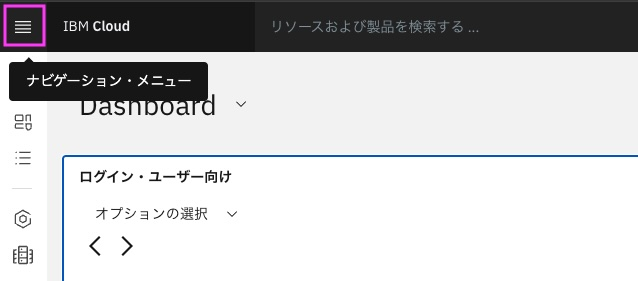 
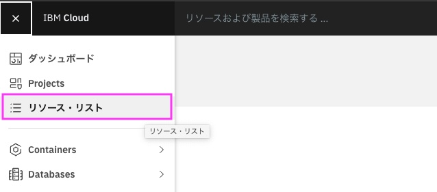 

### 1-2. watsonx.ai Studioのリソースの表示
リソース・リストから[AI/機械学習]のグループを見つけて、その中に含まれている watsonx.ai Studio のサービスを見つけて、表示されている名前をクリックします。 
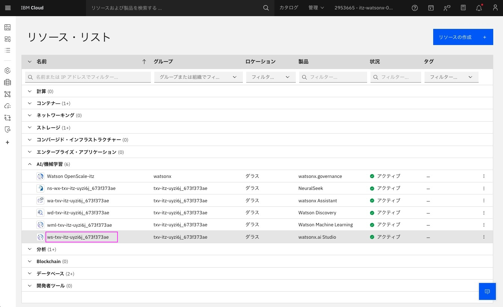 

### 1-3. watsonx.ai Studio トップページの表示
watsonx.ai Studioのリソースが表示されるので、[Launch in][v]の[v]をクリックして、表示されたメニューから[watsonx]を選びます。
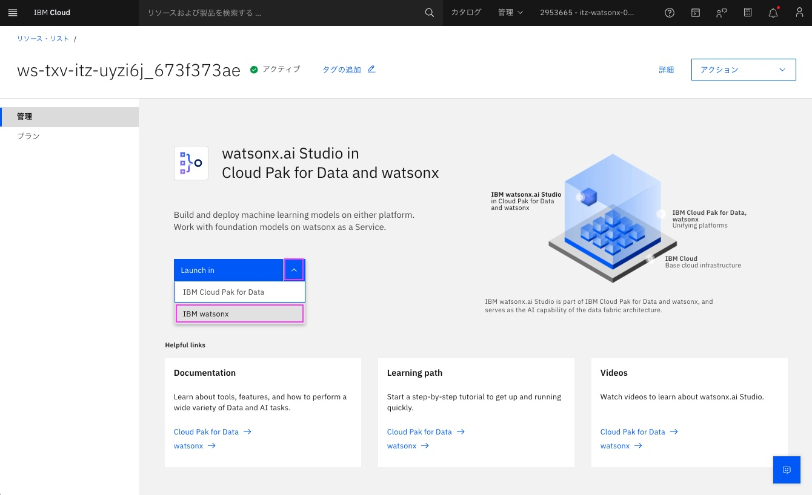 
&nbsp; 
&nbsp; 
watsonx.ai Studioのトップページが開きます。「watsonxへようこそ」というウィンドウが表示された場合は右上の[X]をクリックして閉じてください。 
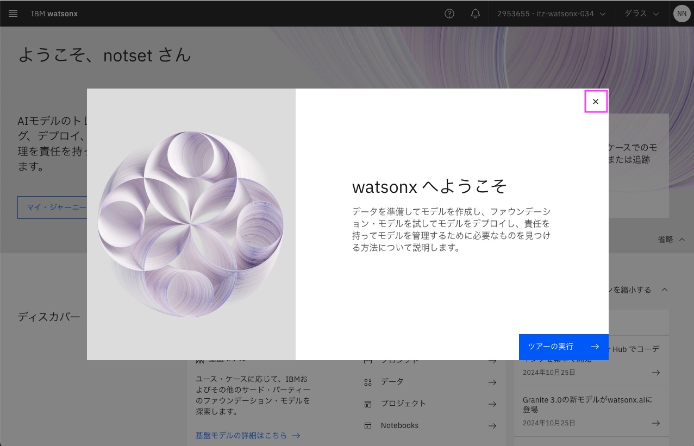 

「さらに詳しくみる」というウィンドウが表示された場合は右上の[X]をクリックして閉じてください。 
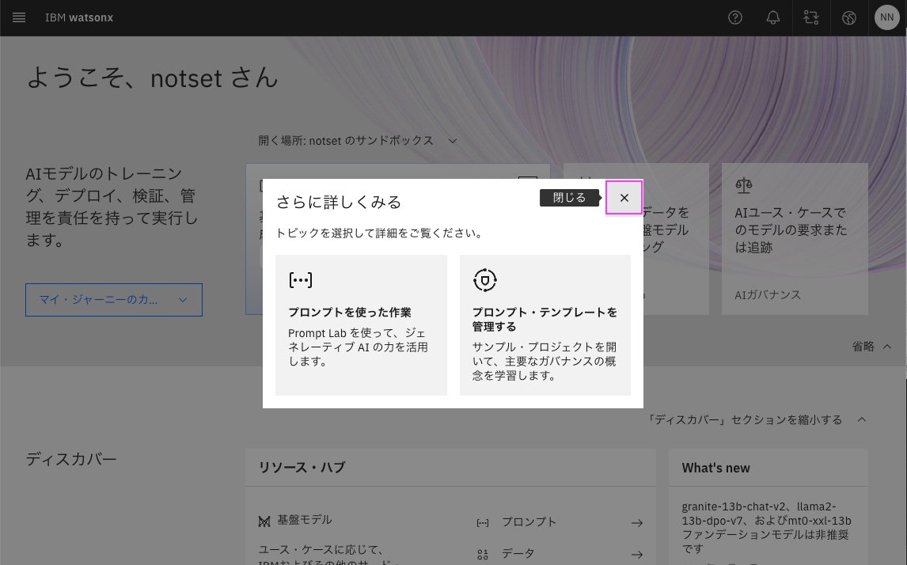 
&nbsp; 

### 1-4. サンドボックス・プロジェクトの有無を確認
画面を下にスクロールし、[最近の作業]欄にある[プロジェクト]のタイルを見つけてください。
「〇〇のサンドボックス」というプロジェクトが作成されていれば準備完了です(〇〇は任意の文字列)。
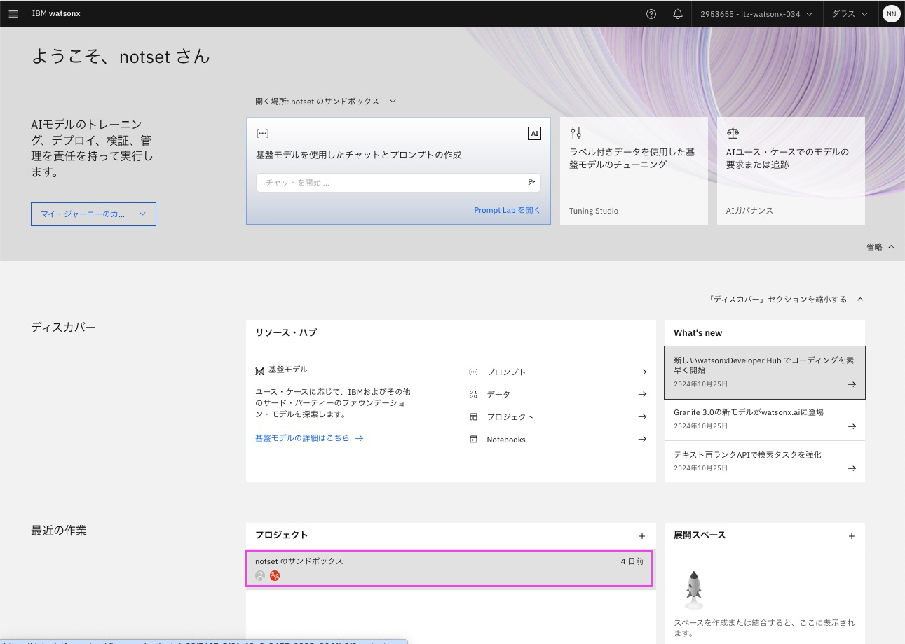 

### 1-5. (サンドボックス・プロジェクトがない場合) サンドボックス・プロジェクトの作成
1. [プロジェクト]のタイルの内にある`サンドボックス・プロジェクトの作成`をクリック
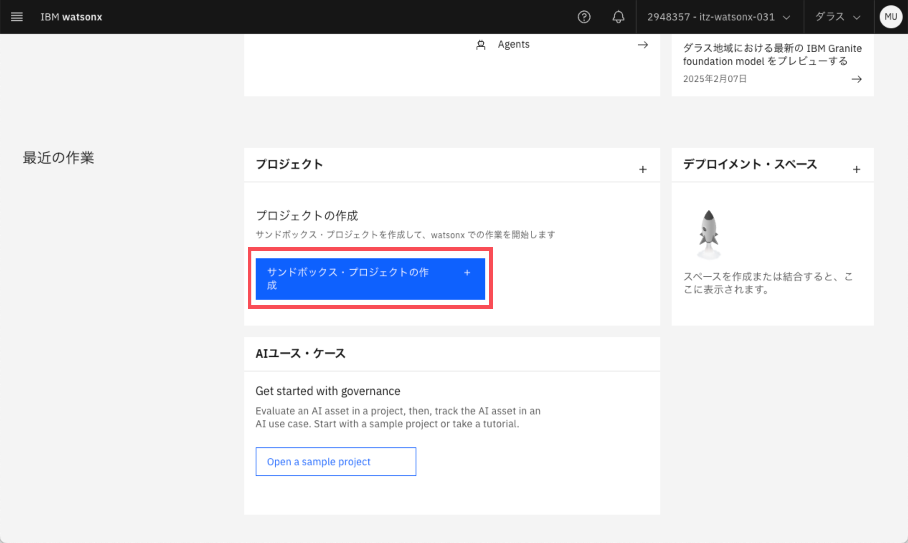
2. 「〇〇のサンドボックス」というプロジェクトが作成されたら準備完了です(〇〇は任意の文字列)。
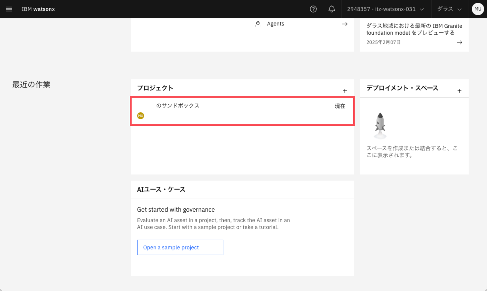

### 1-6. (サンドボックス・プロジェクトが作成できない場合) プロジェクトの作成
1. [プロジェクト]のタイルの右上にある[+]をクリック
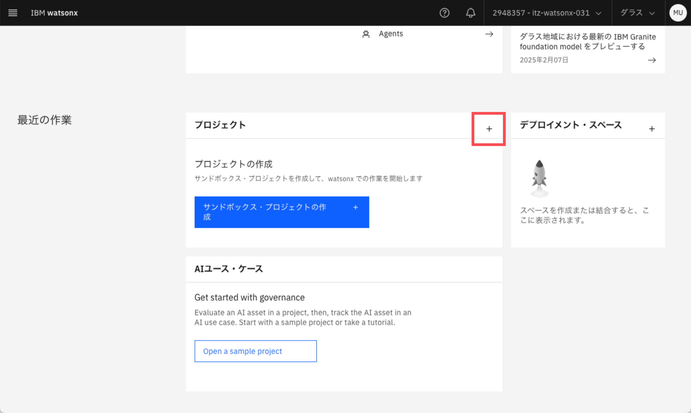
2. 名前を入力する (特に指定はありません)
    - 例) AIエージェントハンズオン
3. `作成`をクリック
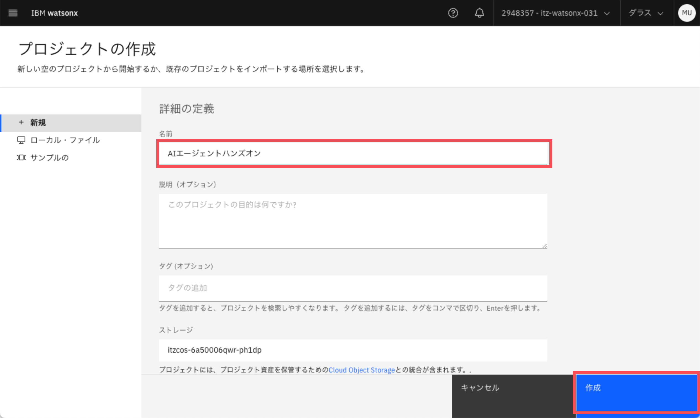
4. `管理`をクリック
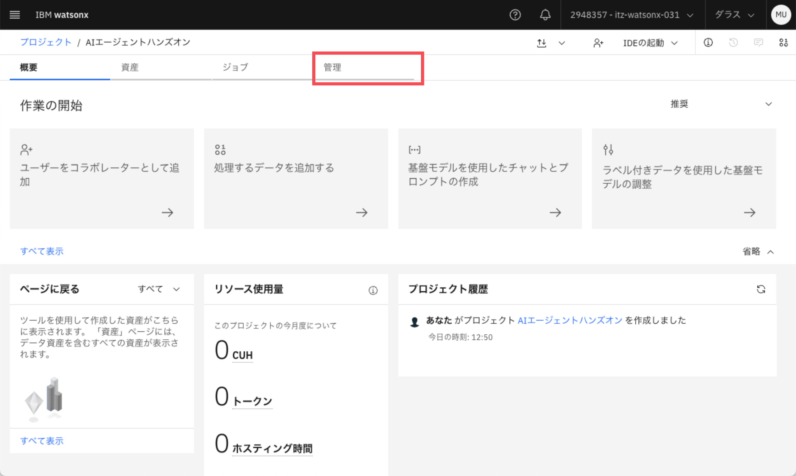
5. `サービス及び統合`をクリック
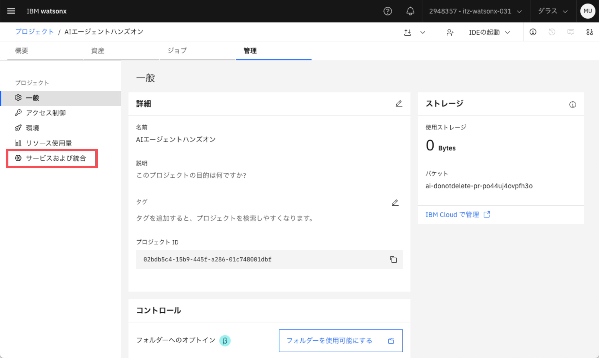
6. `サービスの関連付け`をクリック
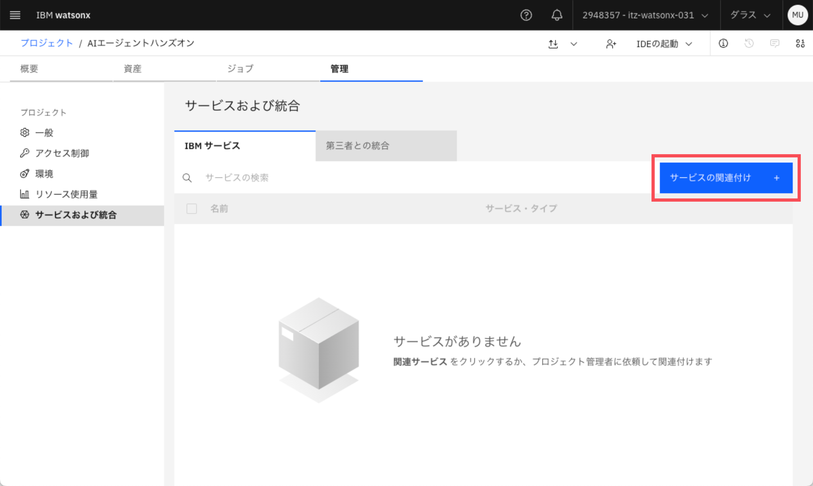
7. タイプ列に「Watson Machine Learning」と書いてある行にチェックを入れる
8. `アソシエイト`をクリック
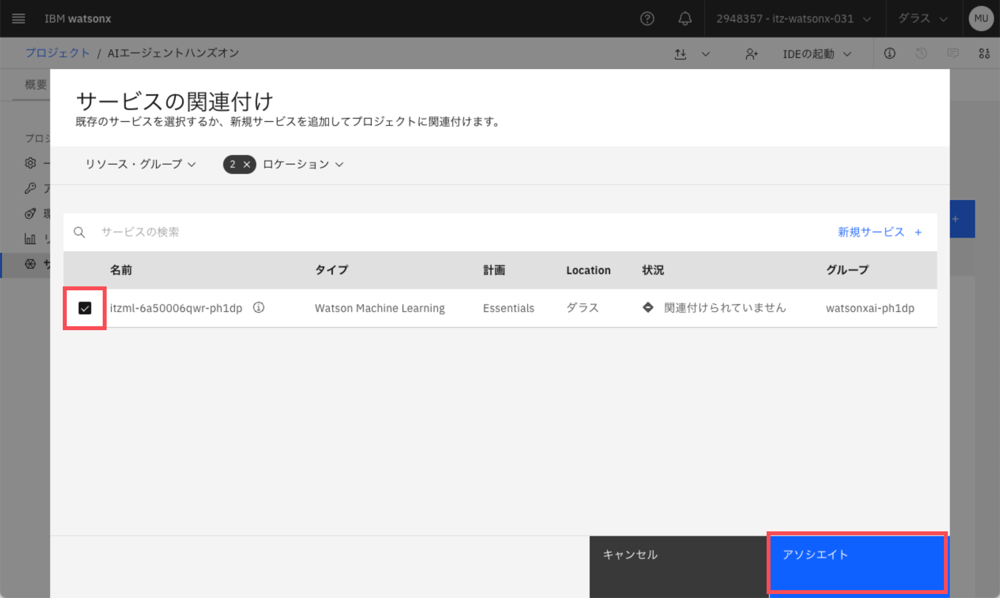
9. ホーム画面に戻る
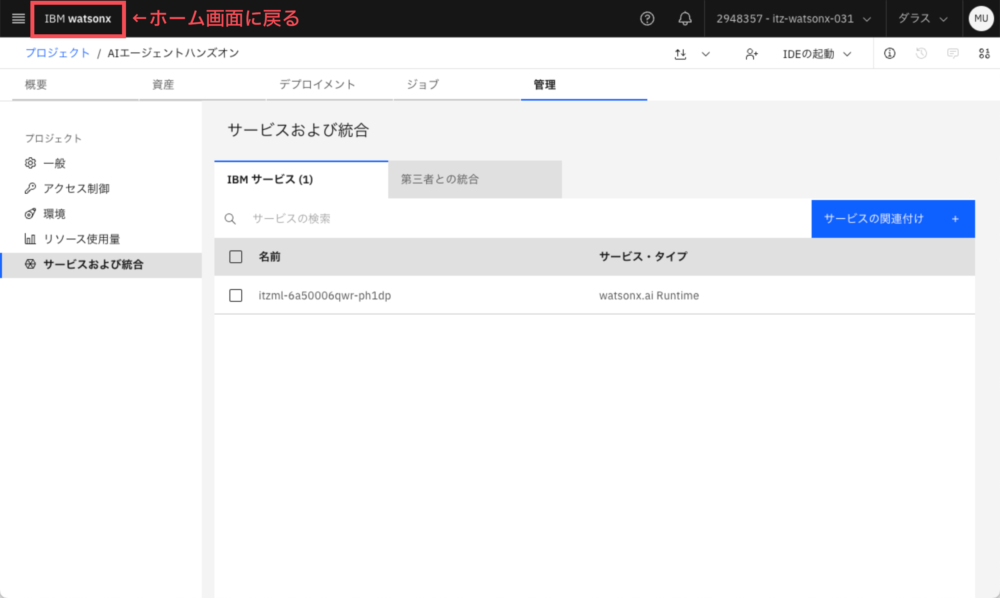

---
[作って学ぶAIエージェント〜watsonx.aiでチャットボットを作ってみよう〜 - トップページに戻る](../README.md)
